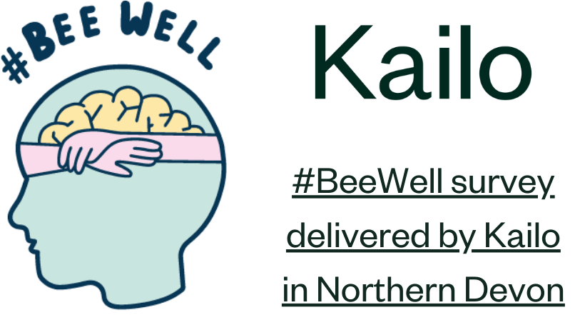

# Amy Heather

```{include} ../badges/amy_heather_badges.txt
```

> Postdoctoral Research Associate at the University of Exeter

## Current projects

`````{grid} 2
````{grid-item-card} October 2022 - April 2024

[](../project_pages/kailo.md)
````
````{grid-item-card} October 2023 - April 2024

**Pilot work on neonatal outcomes**, exploring causal inference methods, cardiotocography (CTG) data, and identification of hypoxic ischaemic encephalopathy (HIE)
````
`````

## Previous projects

`````{grid} 2
````{grid-item-card} May - October 2023

[SAMueL-2](../project_pages/samuel_1.md)
````
````{grid-item-card} Ad-hoc Spring 2023

IPACS
````
`````

## Publications

```{include} ../publications/amy_heather_publications.txt
```