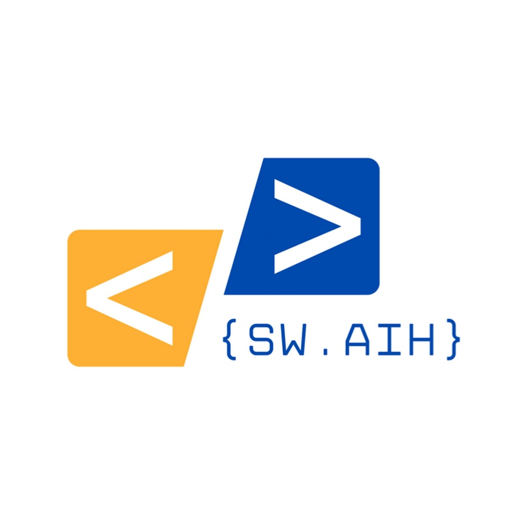

# Andy Mayne

[](https://orcid.org/0000-0003-1263-2286) [](https://www.linkedin.com/in/andy-mayne/)

> Chief Analytical Scientist, PenCHORD Associate Research Fellow & GW-SDE Chief Technology Officer

## Current projects

`````{grid} 2
````{grid-item-card} SWAIH (South West Analytics and Infrastructure in Healthcare)

[](https://sites.google.com/nihr.ac.uk/swaih/home)
````
`````