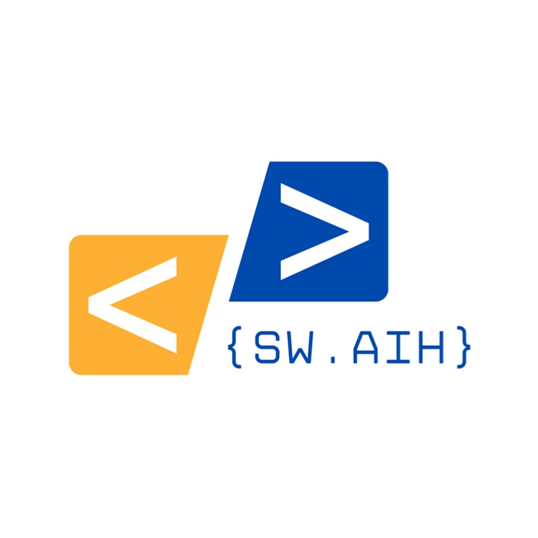

# Chrissie Walker

```{include} ../badges/chrissie_walker_badges.txt
```

> Research & Operations Manager, PenCHORD

I have extensive project management and operational experience in both commercial and academic settings. I joined PenCHORD in late 2021 with responsibility for operational oversight of the group, including HR, finance, governance, and monitoring of research outputs and outcomes.

## Current projects

`````{grid} 2
````{grid-item-card} SWAIH (South West Analytics and Infrastructure in Healthcare)

[](https://sites.google.com/nihr.ac.uk/swaih/home)
````
`````