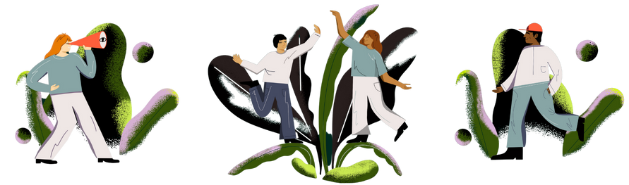

# Kailo

> A systemic approach to improving adolescent mental health

*This page is written by Amy Heather, 21st March 2024.*

Since October 2022, I have been working alongside others on Kailo to deliver the #BeeWell survey to schools in Northern Devon. You can find out more about Kailo below! However, this page mainly focuses specifically on the #BeeWell survey.



## Introduction

The #BeeWell survey is a school-based wellbeing survey being delivered to schools in Northern Devon in the academic year 2023-24. There are two versions of the survey - a standard survey being delivered at seven mainstream schools, and a symbol version being delivered at two non-mainstream schools. You can find out more about the survey at [https://kailo.community/beewell/](https://kailo.community/beewell/).

```{image} ../images/beewell_kailo_colour_logo.png
:alt: Kailo #BeeWell logo
:width: 400px
:align: center
```
<br>

I'd like to thank the #BeeWell team for creating and sharing the #BeeWell survey, and allowing adaptation of the survey. For further information about #BeeWell, visit [https://beewellprogramme.org/](https://beewellprogramme.org/).

The video below provides a helpful introduction to the survey. It was designed to introduce young people to the survey.

<iframe style="display: block; margin: auto;" width="560" height="315" src="https://www.youtube.com/embed/jmYH7F2Bd4Q?si=O2POhzR7WlI-I8sE" title="YouTube video player" frameborder="0" allow="accelerometer; autoplay; clipboard-write; encrypted-media; gyroscope; picture-in-picture; web-share" allowfullscreen></iframe>

## Surveys

Survey booklets for the standard and symbol surveys are embedded below. If you'd like to find out more about the surveys delivered, please see information about the survey that I have [archived on OSF](https://osf.io/dyfsv/).

<iframe style="display: block; margin: auto;" width="560" height="400" src="https://kailo.community/wp-content/uploads/2024/01/Standard-BeeWell-Survey-V2.1-Devon.pdf"></iframe>

<br>

<iframe style="display: block; margin: auto;" width="560" height="400" src="https://kailo.community/wp-content/uploads/2023/08/Symbol-Survey.pdf"></iframe>

## Dashboards

Survey from the survey will be shared using dashboards (with dashboards for school-level and area-level dashboards). These are publically available with synthetic data. These have been produced using Streamlit.

* GitHub repository: [https://github.com/kailo-beewell](https://github.com/kailo-beewell)
* Package used to produce dashboards: [kailo-beewell-dashboard](https://github.com/kailo-beewell/kailo_beewell_dashboard_package).
* Streamlit dashboards:
    * Standard survey school dashboard - [](https://synthetic-beewell-kailo-standard-school-dashboard.streamlit.app/)
    * Symbol survey school dashboard - [](https://synthetic-beewell-kailo-symbol-school-dashboard.streamlit.app/)
    * Area-level dashboard - [in development](https://github.com/kailo-beewell/synthetic_northern_devon_dashboard)

As an example, the standard survey dashboard is embedded below.

<iframe style="display: block; margin: auto;" src="https://synthetic-beewell-kailo-standard-school-dashboard.streamlit.app/?embed=True" height="800" width="80%"></iframe>

## Find about more about Kailo...

### Kailo website

[https://kailo.community/](https://kailo.community/)

### Kailo project summary

Kailo represents a collaboration between University College London, Dartington Service Design Lab, the University of Exeter, the Anna Freud National Centre for Children and Families, and UCL Partners.   

Poor adolescent mental health is a growing public health concern of high policy relevance, with a significant body of scientific research evidencing the individual, societal and economic impacts over the life-course. With rising rates of poor mental health in young people, and services strained to meet demands, Kailo focuses on understanding the key social determinants of poor adolescent mental health given local context, and co-design of sustainable preventative initiatives based in the community to support young people. 

Operating in two intentionally distinct areas – Northern Devon and Newham – Kailo has developed frameworks for understanding local challenges and designing preventative work. These have broadly involved:   
1. Identifying and prioritising key issues: This was achieved through conversations with young people, system leaders, practitioners, and organizations working closely with young people and broader communities. For example, in Northern Devon, this was with 195 young people and over 100 other local actors. 
2. Co-designing preventative strategies: Working with groups of young people and organisations to understand the chosen issues in depth - employing methods like participatory group model building. These insights are currently being used to guide the design of preventative strategies. 

Alongside this work, we are also delivering #BeeWell, a school-based wellbeing survey, with 7 mainstream secondary schools and 2 special education settings in Northern Devon. This will gather data from young people across the area, with the survey for mainstream schools adapted to contain key issues identified through Kailo’s work with young people. Results will be used to support and guide work on Kailo, as well as wider work in schools and the local authority. For example, staff will be provided dashboards with results for their school, and will be offered seminars and 1:1 support to help them understand and respond to their results. 

The work in each site is being evaluated using a realist approach. The first phase of the evaluation involves a developmental evaluation to understand how and why Kailo works, for whom, and under what circumstances. There are several key pieces of work contributing to this including: 1) a rapid realist review of place-based approaches to children and young people’s mental health; 2) interviews and focus groups with key Kailo members, local stakeholders, community partners, and young people; 3) a document analysis of strategy documents, meeting notes, Kailo consortium documents, and documents describing the local context in Northern Devon and Newham; and 4) observations of co-design sessions and key Kailo meetings. The second phase of the evaluation involves an impact evaluation, where we will follow the work over time to measure the impact of the co-designed preventative strategies for young people in each location. The evaluation is guided by our Young Person Advisory Groups (YPAGs), which include young people from North Devon and Newham. 

### Grant information

This work is supported by the UK Prevention Research Partnership (UKPRP), which is funded by the
British Heart Foundation, Chief Scientist Office of the Scottish Government Health and Social Care
Directorates, Engineering and Physical Sciences Research Council, Economic and Social Research
Council, Health and Social Care Research and Development Division (Welsh Government), Medical
Research Council, National Institute for Health Research, Natural Environment Research Council,
Public Health Agency (Northern Ireland), The Health Foundation and Wellcome.
