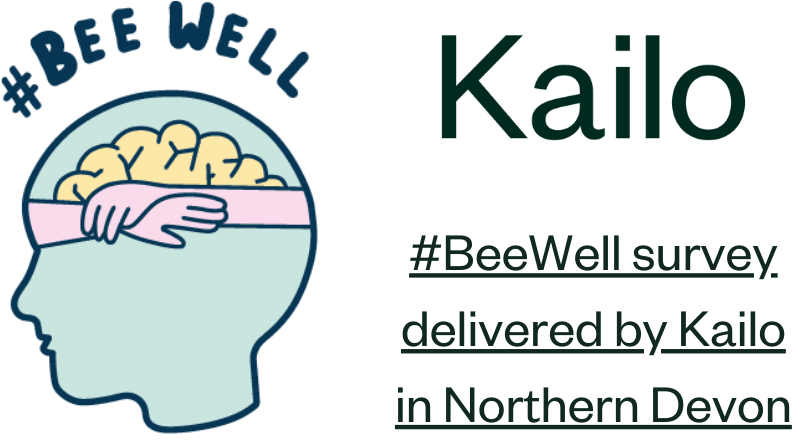

# Kailo

> A systemic approach to improving adolescent mental health

## Summary

Kailo represents a collaboration between University College London, Dartington Service Design Lab, the University of Exeter, the Anna Freud National Centre for Children and Families, and UCL Partners.   

Poor adolescent mental health is a growing public health concern of high policy relevance, with a significant body of scientific research evidencing the individual, societal and economic impacts over the life-course. With rising rates of poor mental health in young people, and services strained to meet demands, Kailo focuses on understanding the key social determinants of poor adolescent mental health given local context, and co-design of sustainable preventative initiatives based in the community to support young people. 

Operating in two intentionally distinct areas – Northern Devon and Newham – Kailo has developed frameworks for understanding local challenges and designing preventative work. These have broadly involved:   
1. Identifying and prioritising key issues: This was achieved through conversations with young people, system leaders, practitioners, and organizations working closely with young people and broader communities. For example, in Northern Devon, this was with 195 young people and over 100 other local actors. 
2. Co-designing preventative strategies: Working with groups of young people and organisations to understand the chosen issues in depth - employing methods like participatory group model building. These insights are currently being used to guide the design of preventative strategies. 

Alongside this work, we are also delivering #BeeWell, a school-based wellbeing survey, with 7 mainstream secondary schools and 2 special education settings in Northern Devon. This will gather data from young people across the area, with the survey for mainstream schools adapted to contain key issues identified through Kailo’s work with young people. Results will be used to support and guide work on Kailo, as well as wider work in schools and the local authority. For example, staff will be provided dashboards with results for their school, and will be offered seminars and 1:1 support to help them understand and respond to their results. 

The work in each site is being evaluated using a realist approach. The first phase of the evaluation involves a developmental evaluation to understand how and why Kailo works, for whom, and under what circumstances. There are several key pieces of work contributing to this including: 1) a rapid realist review of place-based approaches to children and young people’s mental health; 2) interviews and focus groups with key Kailo members, local stakeholders, community partners, and young people; 3) a document analysis of strategy documents, meeting notes, Kailo consortium documents, and documents describing the local context in Northern Devon and Newham; and 4) observations of co-design sessions and key Kailo meetings. The second phase of the evaluation involves an impact evaluation, where we will follow the work over time to measure the impact of the co-designed preventative strategies for young people in each location. The evaluation is guided by our Young Person Advisory Groups (YPAGs), which include young people from North Devon and Newham. 

## Project website

https://kailo.community/

## #BeeWell

https://kailo.community/beewell/

https://github.com/kailo-beewell

<iframe width="560" height="315" src="https://www.youtube.com/embed/jmYH7F2Bd4Q?si=O2POhzR7WlI-I8sE" title="YouTube video player" frameborder="0" allow="accelerometer; autoplay; clipboard-write; encrypted-media; gyroscope; picture-in-picture; web-share" allowfullscreen></iframe>