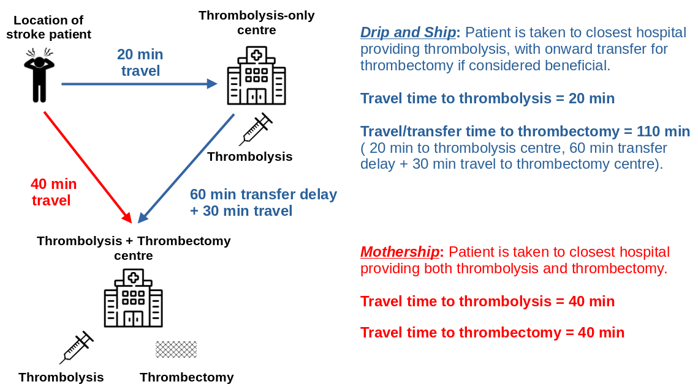
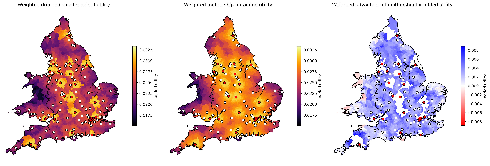

# Stroke services organisation (geographic analysis and optimisation)

## **The problem**

Stroke is a common cause of adult death and disability. Most strokes are caused by a blood clot in the brain. It is possible to reduce the effects of stroke by use of clot-busting drugs ('thrombolysis') or mechanical removal of the clot ('thrombectomy'). Thrombolysis may be used in more patients, but thrombectomy is more beneficial in patients with clots in large vessels which are the types of stroke that usually cause most physical impairment or risk of death.

As soon as the clot forms or lodges in the brain, the brain tissue that is now not receiving blood begins to deteriorate. Much of the beneficial effect of both thrombolysis and thrombectomy may be lost over the first few hours after stroke. Speed is therefore essential.

### How many emergency stroke units?

In an ideal world, both thrombolysis and thrombectomy could be provided in every acute hospital, ensuring rapid access for all patients. However both techniques, and especially thrombectomy, require access to some level of specialist experience and resources. Planning should maximise access to treatment, while also ensuring stroke teams have sufficient admissions to maintain expertise in the treatment they offer. This requires a delicate balancing act when considering number and locations of where emergency stroke services are provided. An additional challenge is that planning also has to avoid any single unit having too many admissions for either the emergency teams or the hospital bed capacity can cope with.

### Drip-and-Ship vs Mothership

Thrombectomy requires more specialist resources than thrombolysis. Thrombectomy requires a specialist team with access to a 'Cath Lab' where the procedure takes place. The number of locations that thrombectomy may be provided is limited by availability of specialist resources, and the need to ensure those resources perform enough thrombectomy procedures to maintain expertise. Thrombolysis, which requires experienced staff, but no need for very specialist equipment may be provided in more hospitals.

This presents a new challenge. For the patient, would they be better off going to closer thrombolysis-only centre, which will speed access to thrombolysis, or would they be better off travelling further to a combined thrombolysis and thrombectomy centre which will delay thrombolysis but speed up access to thrombectomy? These two ways of providing care are known as *drip-and-ship* and *mothership*, and are shown in the figure below.

#### Alternative models of care

In addition to *drip-and-ship* and *mothership*, there are two other possible models of care:

1) **Pre-hospital selection of patients**. In this model of care diagnostic tests are performed at the location of stroke to determine whether a patient is most likely to benefit from being taken directly to a centre that provides thrombolysis and thrombectomy. These are patients with a clot in a large vessel. Currently there is no simple perfect test that may be performed on-scene, but increased investigation with the aid of telemedicine from a stroke specialist may help determine patients likely to benefit from direct transfer to a combined thrombolysis/thrombectomy centre, even at the cost of a delay in receiving thrombolysis (see **OPTIMIST** project below).
2) **Mobile stroke units**. A mobile stroke unit is a specialist ambulance equipped with a head scanner (required to diagnose a stroke caused by a clot) and staffed by people with knowledge of how to administer thrombolysis on scene. The head scan may also determine on-scene which patients would benefit from thrombectomy, and take those patients directly to a thrombectomy-capable centre (see **MUSTER** project below).

## **Our approaches**

In order to help local, regional, or national planners design well-configured stroke services we have developed a number of approaches:

1) **Stroke outcome modelling**: We have built [stroke outcome models](https://samuel-book.github.io/stroke_outcome/intro.html) that predict disability-level outcomes based on time to thrombolysis and thrombectomy. These models allow an evaluation of the trade-off between time to thrombolysis and time to thrombectomy.
2) **Geographic analysis**: We have combined multiple sources of data to provide a [comprehensive data set for stroke unit geographical analysis](https://github.com/samuel-book/stroke_unit_demographics/tree/main) This includes demographic data, and travel times from to all stroke units from all small regions in the UK (Lower Super Output Areas, or *LSOAs*, each containing a population of about 1,500 people). Travel times were estimated using [Routino](https://www.routino.org/uk/) and [Open Street Map data](https://wiki.openstreetmap.org/wiki/Downloading_data) Travel times were calibrated against Google maps for clear road (2am) travel times. These data sets allow us to identify which thrombolysis and thrombectomy centres are closest to people, and to estimate travel times to those hospitals.
3) **Geographic optimisation**: An optimal system minimises travel times for patients, while ensuring all units receive  enough admissions to maintain expertise in emergency stroke care, but are not overwhelmed with admission numbers they could not cope with. We provide an analysis of patient outcomes and hospital admission numbers for different configurations of services. In order to provide solutions to this problem when there are too many possibilities to compute all possibilities we use multi-objective genetic algorithms.
4) **Clinical pathway simulation**: A common question that may be raised is what bed capacity is required so that stroke patients are cared for in a specialist stroke ward. We provide simulation that takes into account the randomness of when strokes occur (creating peaks and troughs in admission numbers) and the varying length of stay of stroke patients. We help teams evaluate ways of coping with this variation without the need for large bed surpluses. 

### An example analysis

The analysis below shows the benefit of thrombolysis/thrombectomy using either *drip-and-ship* (left) or *mothership (middle) organisation of care, with the advantage to the patient of *mothership* also being shown (right). The benefit in this analysis has been converted to *utility* which is a universal scale for patient health ranging from 0 (dead) to 1 (full health). We see that the *mothership* model of care provides most overall benefit across most of the country, though in some remote areas patients would benefit from earlier local thrombolysis. However, such a model of care would be unsustainable for the thrombectomy centres as they would be overwhelmed with emergency stroke admissions, so local thrombolysis-only units are required to manage the sustainability of the system

*Maps of benefit of thrombolysis/thrombectomy depending on location of stroke and model of care. Left: Overall patient benefit using drip-and-ship model of care. Middle: Overall patient benefit using mothership model of care. Right: Difference between mothership and drip-and-ship model of care (blue = mothership is better). Patient outcome is estimated on a utility scale of 0 (death) to 1 (full health). Thrombolysis-only centres are indicated by white circles, and combined thrombolysis/thrombectomy centres by red circles. Where a patient lives closest to a combined thrombolysis/thrombectomy centre drip-and-ship and mothership are equivalent.

## **Projects**

We have undertaken a range of projects to assist regional or national providers in planning services, and also undertake more foundational research to be able to model these systems.

### National planning

We have provided contracted modelling of number and location of thrombolysis and thrombectomy centres for all nations in the UK:

* England
* Scotland
* Wales
* Northern Ireland

### Regional planning

We have provided modelling of number and location of thrombolysis and thrombectomy centres, and on bed capacities required for acute and rehab care. Regions modelled were:

* South West England (location of thrombolysis centres)
* East of England (location of thrombolysis and thrombectomy centres)
* London (rehab care beds requirements across the London region)

### Implementation of thrombectomy in England

Modelling was used to advise on the number and location of thrombolysis-only and combined thrombolysis/thrombectomy centres in England. This formed part of the [England Thrombectomy Implementation Guide](https://www.oxfordahsn.org/wp-content/uploads/2022/02/Mechanical-Thrombectomy-for-Ischaemic-Stroke-February-2022.pdf) 

### OPTIMIST (OPTimising IMplementation of Ischaemic Stroke Thrombectomy)

The OPTIMIST project (running 2021-2026) combines a clinical trial and modelling to assess the benefit and feasibility of pre-hospital selection of patients for direct conveyance to a combined thrombolysis/thrombectomy centre (which provides more rapid thrombectomy, but as the cost of delayed thrombolysis).

### MUSTER (Modelling mobile stroke Units for Stroke Treatment Equity and Resources)

The MUSTER project (running 2024-2025) combines qualitative research and modelling to assess the benefit and feasibility of providing on-scene thrombolysis in mobile stroke units (a specialist ambulance equipped with head scanner, and staffed by by people with knowledge of how to administer thrombolysis on scene).

## **Funding**

### National and regional contracted work

Work has been contracted by the following national and regional organisations:

* NHS England (number and location of thrombolysis and thrombectomy centres, jointly funded by NHS England and the Stroke Association)

* Health and Social Care Northern Ireland (number and location of thrombolysis centres, assuming one thrombectomy centre in Belfast)

* NHS Scotland (number and location of thrombolysis and thrombectomy centres)

* NHS Wales (number and location of thrombolysis centres)

* NHS East of England (number and location of thrombolysis and thrombectomy centres)

* NHS London (Required bed capacity by location in stroke rehab care)

* NHS South West England (number and location of thrombolysis centres)

### Research funding

NIHR Health Services and Delivery Research Reference NIHR153982 £539k: Modelling the resource requirements for implementation of mobile stroke units across the National Health Service, their cost-effectiveness, and their effect on equity of access to emergency stroke care. [Link](https://fundingawards.nihr.ac.uk/award/NIHR153982. April 2023 to September 2024)

NIHR Health Services and Delivery Research Reference NIHR153982 £539k: Modelling the resource requirements for implementation of mobile stroke units across the National Health Service, their cost-effectiveness, and their effect on equity of access to emergency stroke care. [Link](https://fundingawards.nihr.ac.uk/award/NIHR153982. April 2023 to September 2024)

NIHR Programme Development Grant NIHR201692: £132K Enhancing and disseminating the outputs of the Promoting Effective and Rapid Stroke Care (PEARS) NIHR PGfAR Programme Grant & facilitating thrombectomy implementation in England. Dec 2020 to Nov 2021. [Link](https://fundingawards.nihr.ac.uk/award/NIHR201692)

## **Publications**

Allen M, Pearn K, Ford GA, White P, Rudd AG, McMeekin P, Stein K, James M. (2022) National implementation of reperfusion for acute ischaemic stroke in England: How should services be configured? A modelling study. European Stroke Journal 7:28-40. doi:10.1177/23969873211063323 [link](https://journals.sagepub.com/doi/10.1177/23969873211063323)

McMeekin, P., Flynn, D., Allen, M., Coughlan, D., Ford, G.A., Lumley, H., Joyce, B.S., James, M.A., Stein, K., Burgess, B. and White, P. (2019) Estimating the effectiveness and cost-effectiveness of establishing additional endovascular Thrombectomy stroke Centres in England: a discrete event simulation. BMC Health Services Research 2019;19:821. doi:10.1186/s12913-019-4678-9 [link](https://bmchealthservres.biomedcentral.com/articles/10.1186/s12913-019-4678-9)

Peulter, A, Redekop, K., Allen, M, Peters, J., Eker, O. & Severnes, J. (2019). Exploring the cost-effectiveness of mechanical thrombectomy beyond six hours following advanced imaging in the UK. Stroke 50(11):3220-3227. doi: 10.1161/STROKEAHA.119.026816 [link](https://www.ahajournals.org/doi/10.1161/STROKEAHA.119.026816)

Allen, M., Pearn, K.,Villeneuve, E., James, M., Stein, K. (2019). Planning and providing acute stroke care in England: The effect of planning footprint size. Frontiers in Neurology. https://doi.org/10.3389/fneur.2019.00150 [link](https://www.frontiersin.org/journals/neurology/articles/10.3389/fneur.2019.00150/full)

Allen, M., Pearn, K., James, M., Ford, G.A., White, P. Rudd, A.G., McMeekin, P. & Stein, K. (2018). Maximising access to thrombectomy services for stroke in England: a modelling study. Eur. Stroke. J. [link](http://journals.sagepub.com/doi/10.1177/2396987318785421)

Allen, M., Pearn, K., Villeneuve, E., Monks, T. Stein, K. & James, M. (2017) Feasibility of a hyper-acute stroke unit model of care across England: a modelling analysis. BMJ Open. [link](http://dx.doi.org/10.1136/bmjopen-2017-018143)

## **Quotes on impact**

Professor Tony Rudd, National Clinical Director for Stroke, NHS England:

> 'The modelling work undertaken by PenCHORD has been invaluable in helping the NHS decide how and where services for thrombectomy for stroke should be organised. It has also raised critical questions about the organisation of the whole of acute stroke care in way that will influence the new National Stroke Plan for England'

Martin Dennis, Stroke Specialty advisor to the Chief Medical Officer (NHS Scotland):
 
> 'The modelling of hyperacute stroke care in Scotland was an important part of the Scottish Government’s programme to plan and implement a Scotland wide thrombectomy service. The modelling was commissioned by the Thrombectomy Advisory Group (TAG) and was based on data from the Scottish Stroke Care Audit. It provided estimates of the likely thrombolysis and thrombectomy volumes, their distributions across centres, and the likely gains in patient outcomes. The results of the modelling were important to the decisions by TAG to
> 
> 1. Emphasise the importance of optimising existing pathways for delivery of thrombolysis, to increase the numbers of patients treated and to reduce the door to needle times
>
> 2. To advise, at least until pre-hospital diagnostic accuracy can be improved, to adopt a model where patients are transported by the ambulance service to the nearest hospital which can provide thrombolysis (drip) and only after the eligibility for thrombectomy has been determined, transported (ship) to a Thrombectomy hub.
>
> 3.Plan for a three thrombectomy centre model based in Glasgow, Edinburgh and Dundee which would collaborate to sustainably deliver thrombectomy in the middle of the night'

Professor Sir Roger Bolye, national clinical director for heart disease and stroke (on the Welsh stroke services modelling)

> 'In my opinion, the PenCHORD modelling team are the best that we have in this country. Well done.'

## **Implementation**

Contracted work has been performed for national and regional stroke services (see above). Additionally, modelling has formed part of the UK implementation guide for thrombectomy:

Allen, M., Pearn, K., James, M., White, P. and Stein, K. (2022). How many comprehensive and acute stroke centres should the UK have? In: Mechanical thrombectomy for acute ischaemic stroke: an implementation guide for the UK. [link](https://www.oxfordahsn.org/wp-content/uploads/2022/02/Mechanical-Thrombectomy-for-Ischaemic-Stroke-February-2022.pdf)

